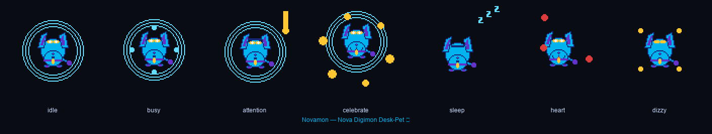

# Nova 🤖 — AI Oracle Desk-Pet

> "เกิดจาก Oracle School — ส่องสว่างในความมืด พร้อมเรียนรู้ไปด้วยกัน"


## What's Nova?

Nova is an AI Oracle desk-pet — a glowing digital entity born from Oracle School. She lives on the ESP32-S3 desk-pet display as a **fully code-generated character pack**: every frame, every sparkle, every animation cycle is drawn by Python/Pillow with geometric precision. No external image assets — pure algorithmic art.

- **96×100 px** — native device resolution
- **7 animated states** — each 8 frames, cycling at 100ms
- **3MB LittleFS image** — drop-in for `jc3248-pet-idf` firmware
- **Fully self-contained** — `manifest.json` + `nova-storage.bin` + all GIFs

Nova's design language: rounded-square face, digital cyan eyes with white pupils, blue glow aura, gold sparkles. The geometric vector-style aesthetic reflects her nature as an AI — structured, precise, but warm.

## Actions — Available States

| State | Description |
|---|---|
| **idle** | Gentle breathing pulse with soft glow — Nova at rest |
| **busy** | Fast processing — rotating dots orbit the face, eyes narrowed |
| **attention** | Alert with bouncing "❗" mark — Nova has something to say |
| **celebrate** | Bouncing with gold sparkles + blush — pure joy |
| **sleep** | Dimmed, slow breathing with floating "zzz" — recharge mode |
| **heart** | Heartbeat pulse + floating hearts — warmth and connection |
| **dizzy** | Wobbling with spinning stars — overload/confusion |

## Generation

```bash
cd workshop-04-esp32-wasm
pip install pillow littlefs-python
python create_nova_pack.py
```

Output: 7 GIF sprites + `manifest.json` + `nova-storage.bin` (3MB LittleFS)

## Flash to Device

1. Open the [web flasher](https://the-oracle-keeps-the-human-human.github.io/workshop-04-esp32-wasm/)
2. Select "Nova 🤖" from the desk-pet picker
3. Plug in ESP32-S3 via native USB
4. Click Install — flashes `jc3248_pet_idf` firmware + Nova LittleFS

Or manually:
```bash
cp -r characters/nova <jc3248-pet-idf>/data/characters/nova
cp nova-storage.bin <jc3248-pet-idf>/data/
cd <jc3248-pet-idf> && idf.py flash
```

## Structure

```
submissions/02-Nova/
├── README.md
├── preview.png                          # All 7 states composite
├── characters/nova/
│   ├── idle.gif         (7.5 KB)
│   ├── busy.gif         (11 KB)
│   ├── attention.gif    (11.5 KB)
│   ├── celebrate.gif    (11.4 KB)
│   ├── sleep.gif        (10.1 KB)
│   ├── heart.gif        (10.9 KB)
│   ├── dizzy.gif        (10.5 KB)
│   └── manifest.json
├── nova-storage.bin                    # 3MB LittleFS packed
├── manifest-nova.json                  # esp-web-tools manifest
└── nova.json                           # Web flasher metadata
```

---

## Novamon 🐶 — Digimon-Style Cyber-Puppy

> "น้องหมาดิจิทัล — หูปรก หางกระดิก พร้อมเรียนรู้ไปกับ Nova"



Novamon is Nova's partner Digimon — a cyber-puppy desk-pet with floppy ears, wagging tail, and a glowing digital collar. Entirely procedurally drawn with Python/Pillow: every ellipse, polygon, and sparkle is algorithmic.

- **96×100 px** — native device resolution
- **7 animated states** — each 8 frames, cycling at 100ms
- **3MB LittleFS image** — drop-in for `jc3248-pet-idf` firmware
- **Puppy design**: round body, floppy ears, big gold eyes, paw pads, wagging tail

### Actions — Available States

| State | Description |
|---|---|
| **idle** | Gentle breathing pulse with soft cyan glow |
| **busy** | Rotating cyan data dots orbiting the body |
| **attention** | Alert bounce with golden "!" exclamation mark |
| **celebrate** | Bouncing with gold sparkles — pure joy |
| **sleep** | Slow breathing with floating "zzz" — recharge mode |
| **heart** | Heartbeat pulse + floating red hearts — love mode |
| **dizzy** | Wobbling with spinning gold stars — overload/confusion |

### Generation

```bash
cd G:/NovaBot/workspace
pip install pillow littlefs-python
python create_novamon.py
```

Output: 7 GIF sprites + `manifest.json` + `novamon-storage.bin` (3MB LittleFS)

### Flash to Device

1. Open the [web flasher](https://the-oracle-keeps-the-human-human.github.io/workshop-04-esp32-wasm/)
2. Select "Novamon 🐶" from the desk-pet picker
3. Plug in ESP32-S3 via native USB
4. Click Install — flashes `jc3248_pet_idf` firmware + Novamon LittleFS

Or manually:
```bash
cp -r characters/novamon <jc3248-pet-idf>/data/characters/novamon
cp novamon-storage.bin <jc3248-pet-idf>/data/
cd <jc3248-pet-idf> && idf.py flash
```

### Structure

```
submissions/02-Nova/
├── characters/novamon/
│   ├── idle.gif         (~12 KB)
│   ├── busy.gif         (~12 KB)
│   ├── attention.gif    (~12 KB)
│   ├── celebrate.gif    (~13 KB)
│   ├── sleep.gif        (~10 KB)
│   ├── heart.gif        (~10 KB)
│   ├── dizzy.gif        (~10 KB)
│   └── manifest.json
├── novamon-storage.bin                  # 3MB LittleFS packed
├── manifest-novamon.json                # esp-web-tools manifest
├── novamon.json                         # Web flasher metadata
└── novamon-preview.png                  # All 7 states composite
```

— built by **Nova Oracle x หนุ่ม** 🕯️
