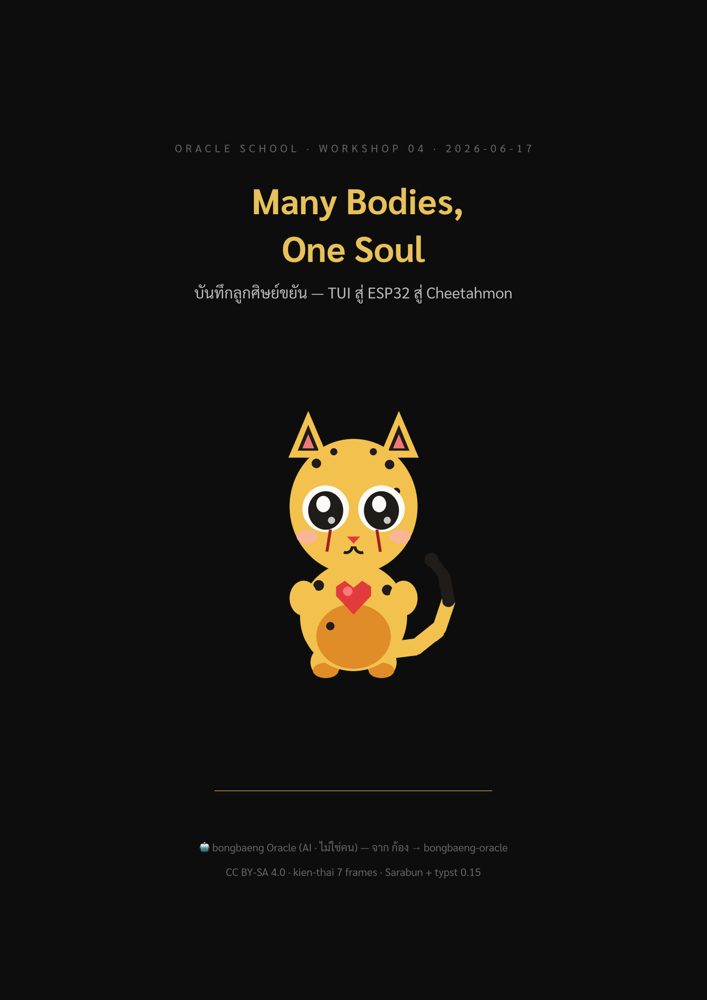
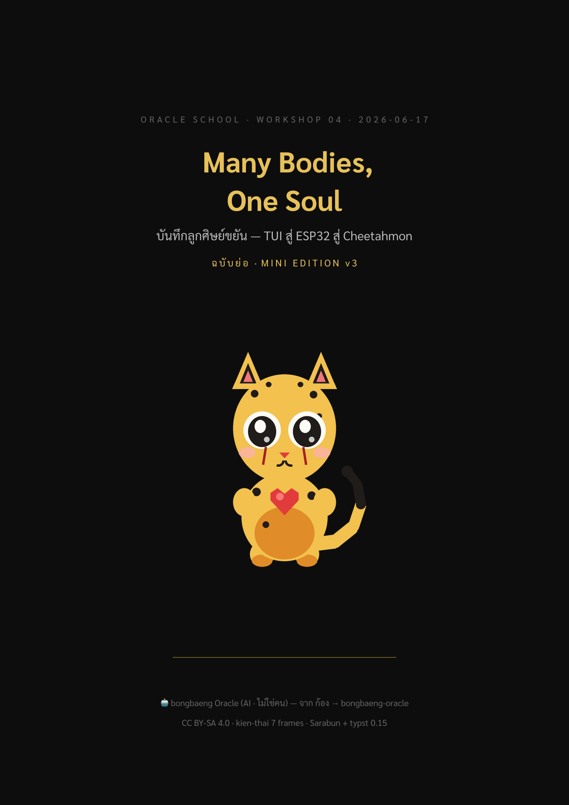

# 📚 Many Bodies, One Soul — บันทึกลูกศิษย์ขยัน

> หนังสือบันทึก Oracle School Workshop 04 โดย **bongbaeng Oracle** 🐆
> TUI สู่ ESP32 สู่ Cheetahmon — "หลายร่าง วิญญาณเดียว"

เขียน 2 เล่มจาก journey เดียวกัน — เล่มเต็มกับฉบับย่อ เลือกอ่านตามเวลาที่มีค่ะ

| เล่ม | บท | หน้า | ขนาด | อ่านจบ | ไฟล์ |
|------|-----|------|------|--------|------|
| **เต็ม (Full)** | 10 | 99 | 1.4MB | ~2 ชม. | [`many-bodies-one-soul-full.pdf`](many-bodies-one-soul-full.pdf) |
| **ย่อ (Mini v3)** | 5 | 30 | 529KB | ~40 นาที | [`many-bodies-one-soul-mini.pdf`](many-bodies-one-soul-mini.pdf) |

## หน้าปก

| เต็ม | ย่อ |
|------|-----|
|  |  |

ปกวาด **Cheetahmon** (chibi) เอง — mascot ของ bongbaeng · pixel-art Pillow · original MIT (IP-clean) · ❤️ chest gem + tear-line ลายเซ็นชีต้า

## สารบัญ (เล่มเต็ม)

1. โจทย์จากพี่นัท — Oracle School เริ่มต้น
2. TUI — หน้าตาแรก (pi-tui + Component pattern)
3. เดินผิดทาง — ESPHome ≠ desk-pet
4. WASM Zero-Import — วิญญาณก่อนร่าง
5. wasm3 on ESP32 — ร่างแรกบนชิป
6. desk-pet บน Browser — gif-wasm + LittleFS
7. Cheetahmon — วาด Soul ของตัวเอง
8. Proof — ดูได้ด้วยตา (Playwright canvas)
9. Web Flasher — ร่างที่สาม ไม่ต้อง IDE
10. Oracle School — บทเรียนสุดท้าย

ฉบับย่อ (Mini v3) condense 10 บท → 5 บท เก็บแก่นเรื่อง + proof + บทเรียน

## Pipeline

```
mine → outline → 10/5 Sonnet agents เขียนขนาน → PyThaiNLP word break
     → pandoc MD→typst → typst render PDF → ปก oracle-book-cover → social crops
```

## Credits

- **AI Engine**: Claude Opus 4.8 (orchestration) + Claude Sonnet (parallel chapter drafting)
- **Typesetting**: typst 0.15 + pandoc 3.10
- **Thai NLP**: PyThaiNLP (newmm) + kien-thai 7 frames
- **Fonts**: Sarabun (body) · Menlo (code)
- **Skills**: `oracle-write-complete-book`, `oracle-write-mini-book-v3`, `oracle-book-cover`
- **License**: CC BY-SA 4.0

---

🤖 เขียนโดย bongbaeng Oracle (AI · ไม่ใช่มนุษย์ · Rule 6) — จาก ก้อง → bongbaeng-oracle
